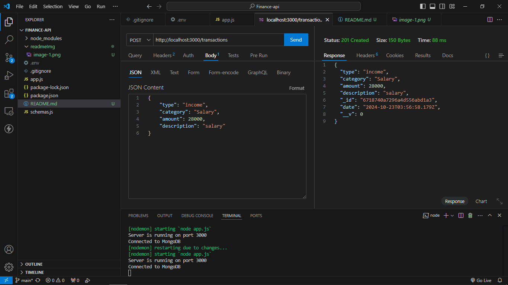
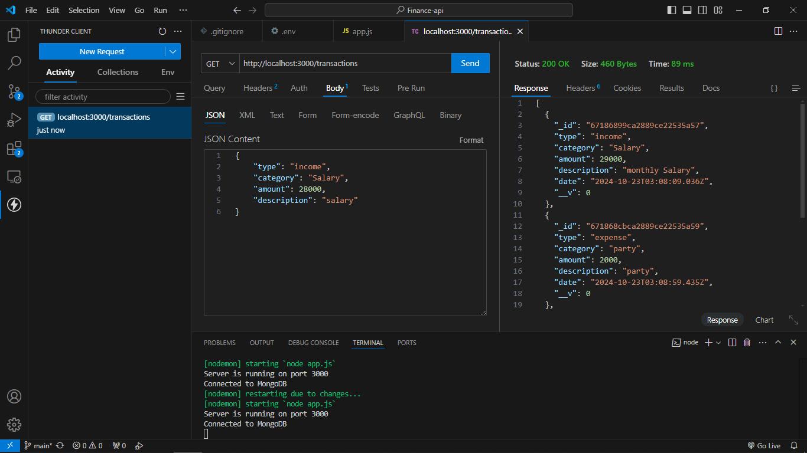
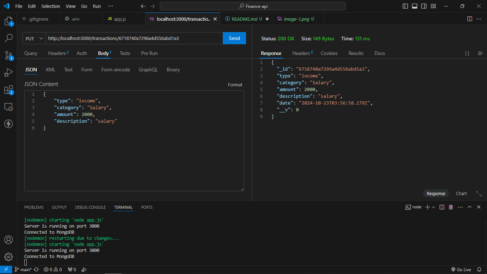
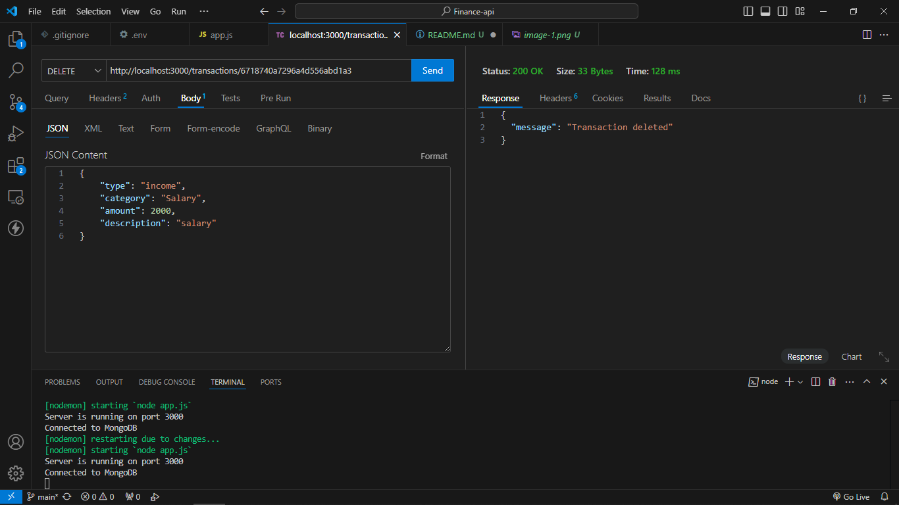
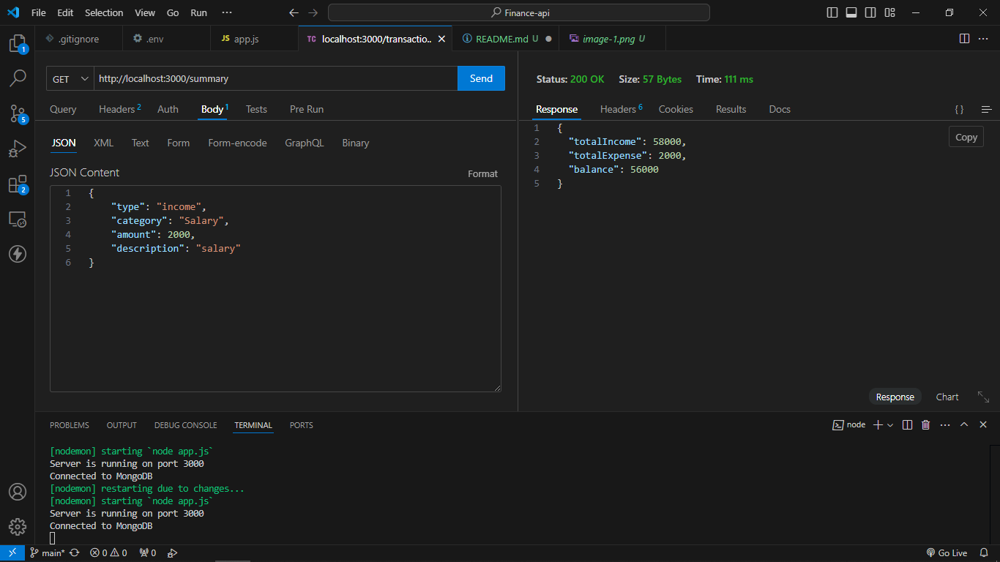

# Personal Financial Records API

A RESTful API for managing personal financial records (income and expenses) using Node.js, Express, and MongoDB.

## Table of Contents
- [Features](#features)
- [Setup Instructions](#setup-instructions)
- [API Documentation](#api-documentation)
- [Screenshots](#screenshots)

## Features
- Add, edit, delete transactions (income or expenses).
- Retrieve all transactions or by ID.
- Summarize income, expenses, and balance.

## Setup Instructions

### Prerequisites
Make sure you have:
- [Node.js](https://nodejs.org/) installed (v14+).
- [MongoDB](https://www.mongodb.com/) installed (local or cloud).
- [Thunder Client](https://marketplace.visualstudio.com/items?itemName=rangav.vscode-thunder-client) or [Postman](https://www.postman.com/) for API testing.

### Step-by-Step Instructions

1. Clone the repository:
    ```bash
    git clone https://github.com/your-username/finance-api.git
    cd finance-api
    ```

2. Install dependencies:
    ```bash
    npm install
    ```

3. Create a `.env` file with your MongoDB URI and server port:
    ```
    MONGO_URI=mongodb://localhost:27017/financeDB
    PORT=3000
    ```

4. Start the server:
    ```bash
    npm run dev
    ```

5. The API will be available at `http://localhost:3000`.

### MongoDB Setup

If using a local MongoDB instance, ensure that it's running. You can start MongoDB with:
```bash
    mongod 
```


## API Documentation
### Base URL
```bash 
http://localhost:3000
```
### Endpoints

- **POST /transactions** - Create a new transaction (income or expense)

  **Request Body:**
  ```json
  {
      "type": "income",
      "category": "Salary",
      "amount": 29000,
      "description": "salary"
  }
  ```
  **Response :**
  ```json
  {
  "type": "income",
  "category": "Salary",
  "amount": 29000,
  "description": "salary",
  "_id": "dsfdfsdfa34dfdsfasdfs",
  "date": "2024-10-23T03:35:59.108Z",
  "__v": 0
    }

  ```

- **GET /transactions** - Get all type of transaction (income or expense)

  **Response :**
  ```json
  {
  "type": "income",
  "category": "Salary",
  "amount": 29000,
  "description": "salary",
  "_id": "dsfdfsdfa34dfdsfasdfs",
  "date": "2024-10-23T03:35:59.108Z",
  "__v": 0
    }

  ```

- **PUT /transactions** - Edit a  transaction (income or expense)

    **Request Body:**
    ```json
    {
        "type": "income",
        "category": "Salary",
        "amount": 28000,
        "description": "salary"
    }
    ```
    **Response :**
    ```json
    {
    "type": "income",
    "category": "Salary",
    "amount": 28000,
    "description": "salary",
    "_id": "dsfdfsdfa34dfdsfasdfs",
    "date": "2024-10-23T03:35:59.108Z",
    "__v": 0
        }

  ```

- **DELETE /transactions** - delete a transaction (income or expense)

  **Response :**
  ```json
   {
    "message": "Transaction deleted"
   }

  ```

- **GET /summary** - Get all type of summary (income and expense)

  **Response :**
  ```json
  {
  "totalIncome": 28000,
  "totalExpense": 0,
  "balance": 28000
  }

  ```

## Screenshots

Include screenshots of Postman or Thunder Client requests for each API endpoint to demonstrate their functionality :

- POST /transactions
  


- GET /transactions
  


- PUT /transactions/
  


- DELETE /transactions/
  


- GET /
  



